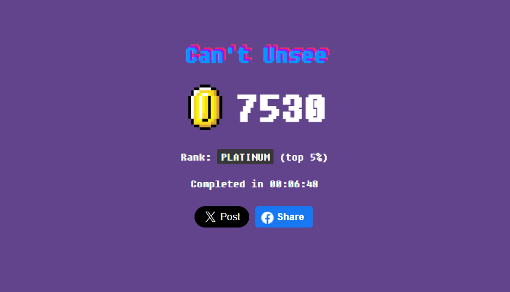

## Hello there, my fellow Alfbuddy! 💖

You've made it—great job! Now, here's the scoop: this markdown file is your **canvas**. Customize it; let your creativity flow!

Remember, you're free to add your personal touch, but keep the sacred requirements intact; they are the guardians of order here. This markdown file should or may include:
- Link to your own file of **"Week 1 [Day 3] : Activity"**
- An **optional** screenshot of playing the game **"Can't Unsee"** and your feedback

Ready to include your output for **Day 3**? Let the customization begin! 🚀✨

<a href="https://www.figma.com/file/mIT55lRSFQFMrZFJ5l7muv/Week-1-%5BDay-3%5D-%3A-Activity-(Community)?type=design&node-id=202%3A37&mode=design&t=kJRPoqlg6YRldSMN-1"> Day 3: Activity </a>

