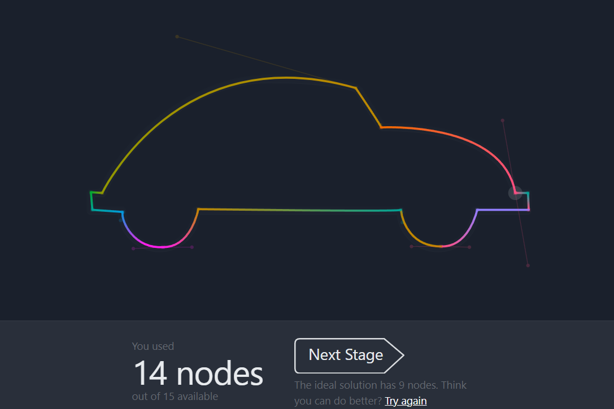
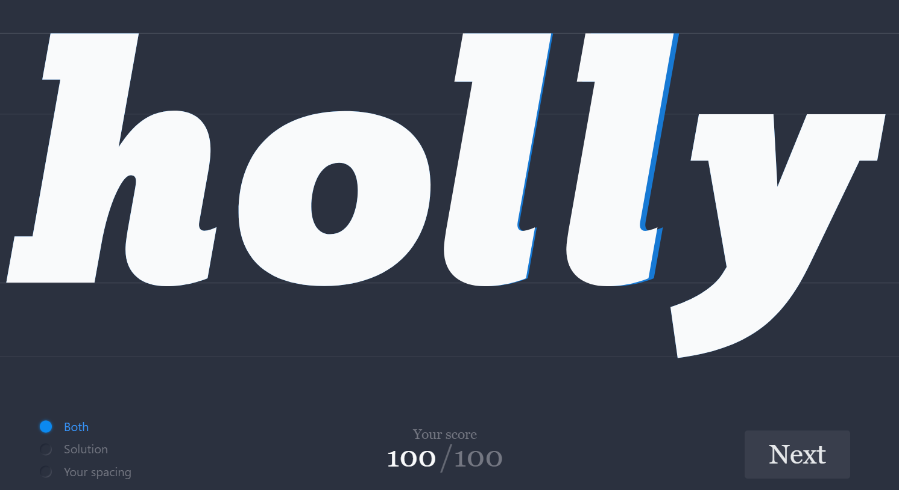

## Hello there, my fellow Alfbuddy! 💖

You've made it—great job! Now, here's the scoop: this markdown file is your **canvas**. Customize it; let your creativity flow!

Remember, you're free to add your personal touch, but keep the sacred requirements intact; they are the guardians of order here. This markdown file should or may include:
- Link to your own file of "Advance Figma Tutorial"
- Brief explanation of your experience or reflection
- An **optional** screenshot of playing the games provided in Day 5 and your feedback

Ready to include your output for **Day 5**? Let the customization begin! 🚀✨

<!-- You may now delete and modify the content of this file -->

<a href="https://www.figma.com/file/PcsIvcl55Yc9ZMAThH49x3/AWSCC-Figma-Workshop%3A-Advance-(Community)?type=design&node-id=5%3A33&mode=design&t=b7RPDIX6BbZXQYdd-1"> Day 5: Advanced Figma </a>

